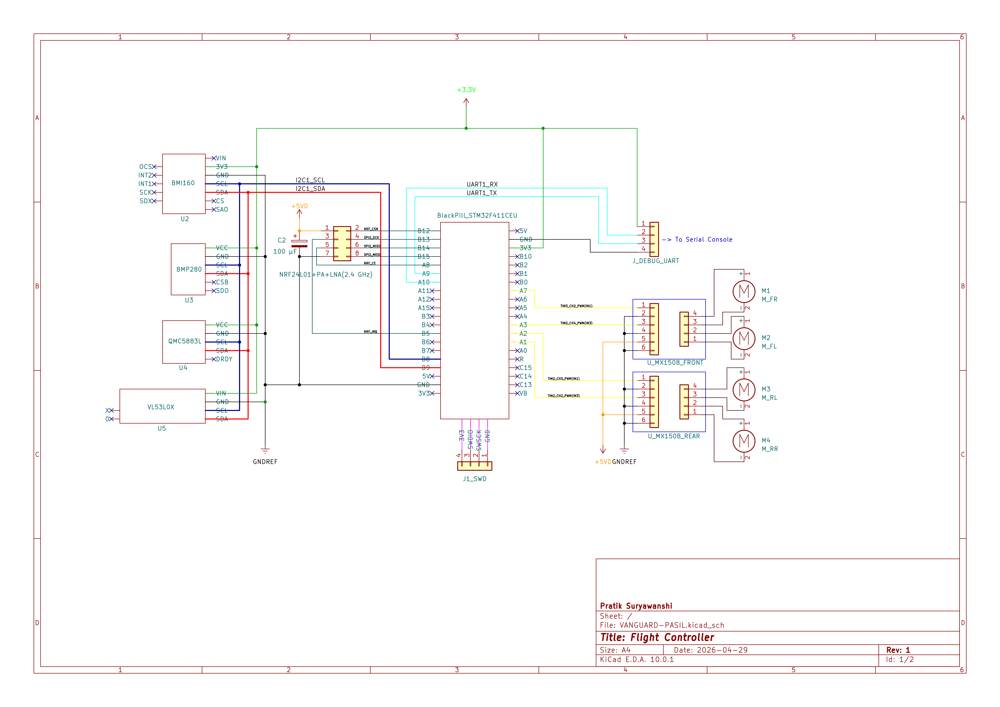
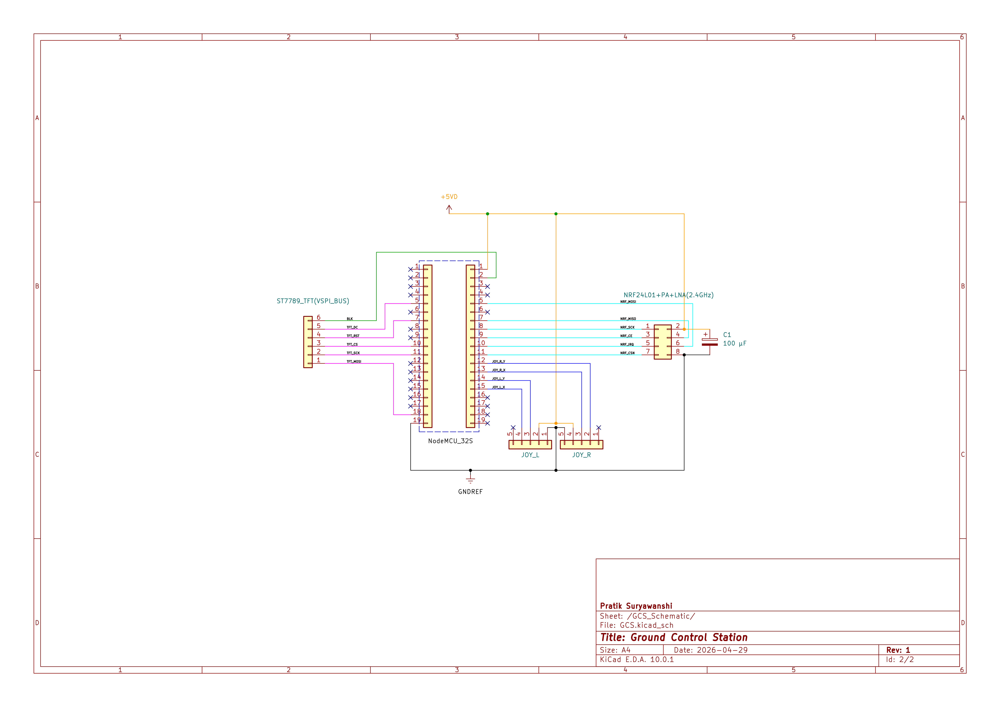
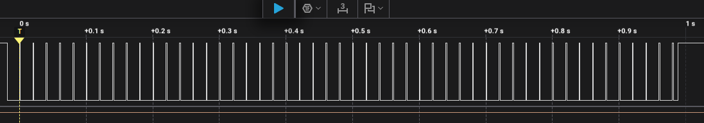

# 🚁 VANGUARD-PASIL
### A Safety-Critical, Distributed Flight Control Testbed

**Document Revision:** E (Production-Ready)

---

## 📌 Overview

VANGUARD-PASIL is a custom-built, RTOS-driven avionics platform designed to validate deterministic flight control, real-time sensor fusion, and hardware-level fault isolation in electrically noisy environments such as multirotor UAV systems.

The system evolved from a bare-metal scheduler into a fully distributed architecture built on Apache NuttX, enabling strict real-time guarantees and modular subsystem validation.

---

## 🧩 System Architecture




**Core Components:**

- **ESP32 Ground Station**
  - User interface and telemetry control
- **NRF24L01 RF Link**
  - Bidirectional low-latency communication
- **STM32F411 Flight Controller**
  - Real-time control loop execution (NuttX RTOS)

**Interfaces:**
- SPI → IMU / high-speed sensors  
- I2C → Environmental sensors (BMP280, etc.)  
- PWM → ESCs / motor control  

**Power Design:**
- Star-ground topology to isolate noise domains  
- Dedicated ultra-low-noise 3.3V LDO for RF subsystem  
- Separation of digital and high-current return paths  

---

## 🎯 Architectural Highlights

### ⏱️ Hard Real-Time Execution
- Deterministic control loop at **500 Hz** (Δt = 0.002 s)  
- NuttX scheduler configured at **Priority 255**  
- Zero tolerance for blocking operations in control path  

---

### 🧠 Advanced State Estimation
- Custom **7×7 Extended Kalman Filter (EKF)**  
- Implemented using ARM CMSIS-DSP library  
- Hardware FPU acceleration on STM32F411  

**Capabilities:**
- Attitude estimation (quaternion-based)  
- Dynamic gyroscope bias tracking  
- Stable operation under high-frequency vibration  

---

### 🔌 Hardware-Level Fault Isolation
- Electrical noise mitigation from ESC flyback  
- Dedicated LDO rail for RF communication  
- Ground loop prevention via star grounding  

---

### 🔄 Asynchronous I/O Architecture
- Kernel-level blocking drivers bypassed  
- Application-level sensor polling implemented  

**Example:**
- BMP280 operated in forced mode via non-blocking I2C  
- Guarantees uninterrupted control loop execution  

---

## 📊 Performance Validation



- **Control Loop Jitter:** < 10 µs variance  
- **EKF Stability:** Maintains converged quaternion under high-RPM vibration  
- **System Behavior:** No observable control degradation under induced electrical noise  

The system architecture is aggressively optimized for embedded constraints. By bypassing native kernel bloat and utilizing hardware DSP, the RTOS and flight control stack leave >90% of SRAM available for future safety-monitor and payload integration.

| Memory Region | Used Size | Total Capacity | Utilization |
| :--- | :--- | :--- | :--- |
| **Flash (ROM)** | 122.2 KB | 512 KB | 23.31% |
| **SRAM (RAM)** | 9.9 KB | 128 KB | 7.59% |
---

## 🛡️ Safety & Failsafe State Machine

### 📡 Signal Loss Mitigation
- NRF24 packet timeout detection: **< 100 ms**  
- Immediate transition to:
  - Auto-level stabilization  
  - Zero-throttle command  

---

### ⚠️ Actuator Kill-Switch
- Trigger condition: sustained telemetry loss  
- Timeout: **2.0 seconds**  
- Action:
  - Deterministic PWM shutdown  
  - Motor output hard lock  

---

### 🔁 State Transitions
| State            | Condition                      | Action                    |
|------------------|------------------------------|---------------------------|
| NORMAL           | Valid telemetry               | Full control              |
| DEGRADED         | Packet loss detected          | Stabilize + throttle cut  |
| FAILSAFE         | >2.0 s signal loss            | PWM termination           |

---

## ⚙️ Build & Deployment

### 🔧 1. Toolchain Setup

Requirements:
- `arm-none-eabi-gcc`
- Apache NuttX build system  

Verify installation:

```bash
arm-none-eabi-gcc --versioni
```

### 🛠️ 2. Configuration & Compilation

Ensure:

Floating-point support enabled:

CONFIG_LIBC_FLOATINGPOINT=y
Disable kernel I2C drivers (except required IMU drivers)

Build:

make distclean
./tools/configure.sh <YOUR_BOARD_CONFIG>
make -j4


### ⚡ 3. Flashing (STM32F411)

Using st-flash:

st-flash write nuttx.bin 0x8000000

Or via OpenOCD / STM32CubeProgrammer as preferred.

## 🚀 Quick Start
git clone https://github.com/<your-repo>/vanguard-pasil.git
cd vanguard-pasil

make distclean
./tools/configure.sh <YOUR_BOARD_CONFIG>
make -j4

st-flash write nuttx.bin 0x8000000


## 📁 Project Structure
/apps            → Application-level control logic
/drivers         → Custom sensor interfaces
/platform        → Board-specific configuration
/docs/images     → Diagrams and performance plots

## 🧪 Validation Environment
High-RPM motor vibration testing
RF packet loss injection
Power noise injection from ESC switching

## 📌 Notes
Designed for deterministic execution under worst-case conditions
Prioritizes control loop integrity over peripheral convenience
Suitable for research, validation, and safety-critical prototyping

## ⚠️ Disclaimer

This system is intended for research and development purposes.
Improper use in real-world flight systems may result in hardware damage or safety risks.
